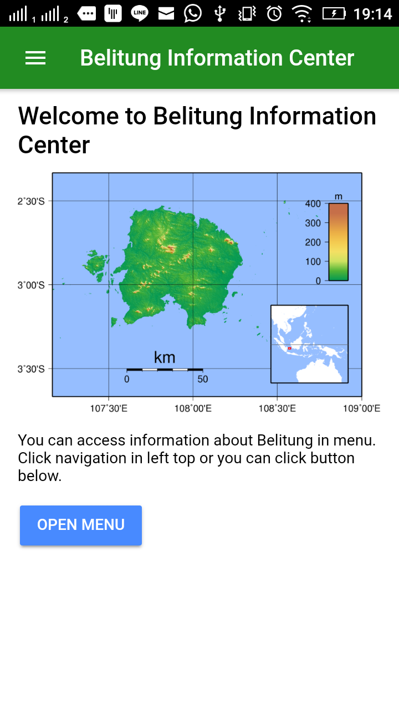
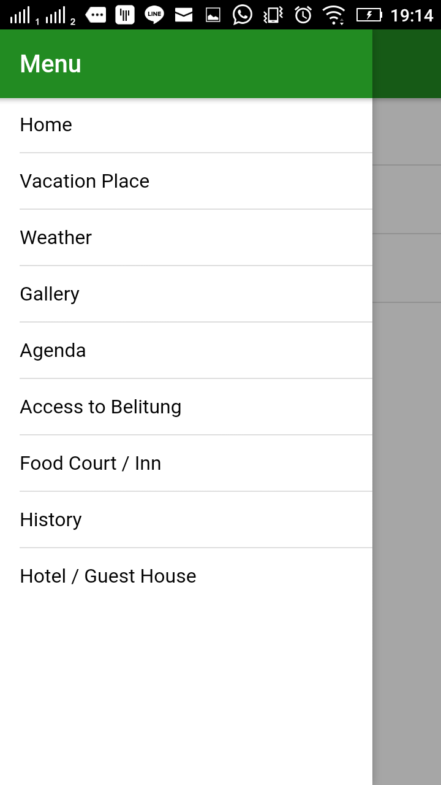
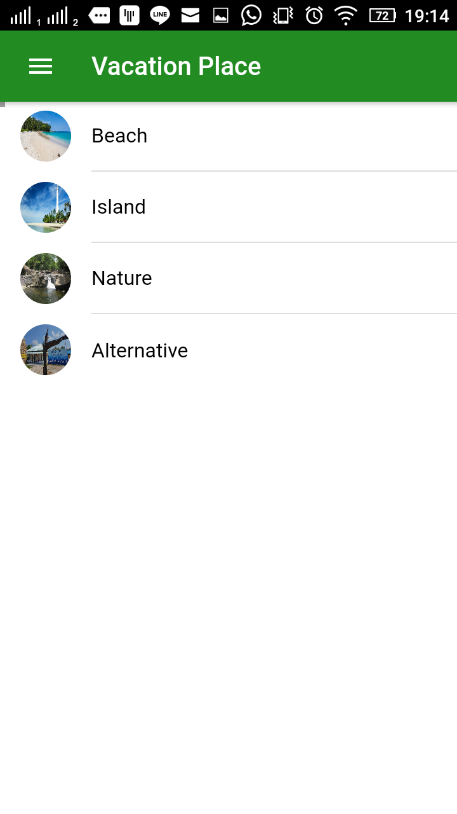
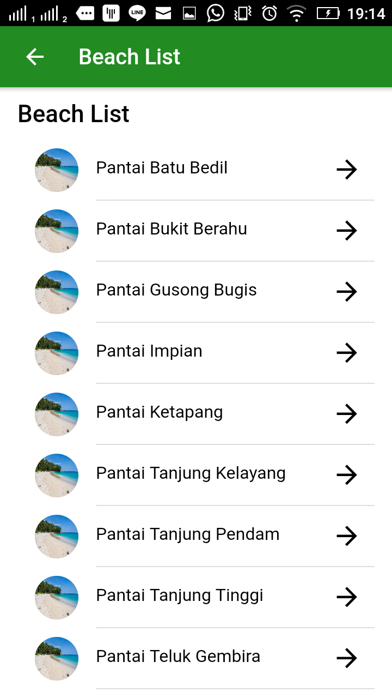

# Belitung Information Center

Using Ionic Framework for Mobile Application, Provide Information of Belitung Island.

## Build Status

| Travis | Codecov |
|:------:|:-------:|
|  |  |

## Screen

### Home Page

### Menu

### Example Page (Vacation)

### Example Page (List of Beach)

## About

Created by : Bervianto Leo Pratama

## LICENSE

MIT
